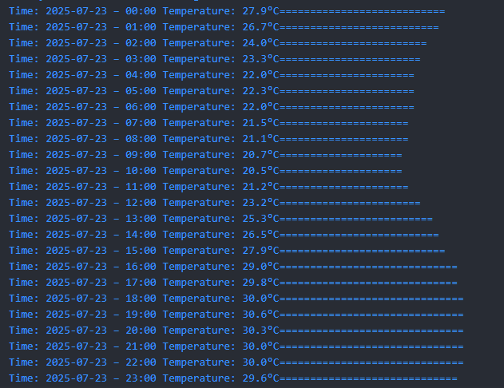

## About

This is a simple command-line weather application built with Dart, following the Clean Architecture principles. It fetches hourly weather data (mocked) for a given city and displays it in a readable terminal output. The project is structured into clear layers (data,core,domain, and presentation), making it modular, scalable, and easy to maintain.

Perfect for practicing architecture patterns or building quick CLI tools in Dart.

Below is a sample hourly temperature output for **Washington**:

## Installation

1.  Clone the repository: `git clone https://github.com/CodeByQafar/dart_cli_weather_clean_arch.git`
2.  Install dependencies: `dart pub get`
3.  Run the application: `dart run`

## ToDo

First of all, we need to write unit tests, improve the performance of the CLI screen, and implement specific failure and exception scenarios.