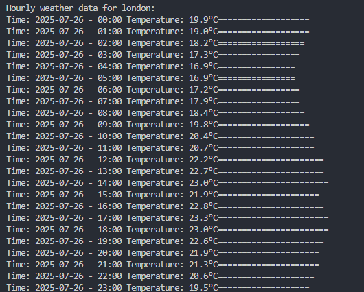

## Demo Mode

The application is currently running in **demo mode**.  
It directly fetches mock hourly weather data from the data source.

Below is a sample hourly temperature output for **Washington**:

## Installation

1.  Clone the repository: `git clone https://github.com/CodeByQafar/dart_cli_weather_clean_arch.git`
2.  Install dependencies: `dart pub get`
3.  Run the application: `dart run`
